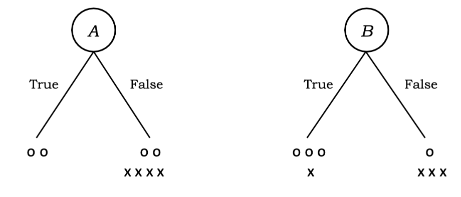

# Intro. to Machine Learning (CS 135)

# Homework 04 (25 points)

For this assignment, you will make modifications to a Python notebook (`hw04.ipynb`) and a Python file (implementation.py) that have been supplied. You will complete the various required sections outlined below in that notebook. When you are done, generate a PDF version of that notebook, including all results (figures, printed results, etc.), for submission to Gradescope. You will also send in the source code for the notebook and two PDF images made by your program that are not embedded in the worksheet, as explained below.

### Adding the graphviz library

Before you start the assignment, you should add one additional library to your Python install; this will allow you to visualize decision trees in a graphical format. You will only need to do the following steps once; after these steps are performed, these tools will be available, along with all the others we have been using. Open the Python project in PyCharm, launch the terminal in PyCharm, and install [graphviz](https://graphviz.org/).[^1]

conda install python-graphviz -y
Once these steps are completed, you can use the package from inside the COMP 135 environment in notebooks and other Python code.

## Decision Trees (37 points)

You will examine the use of decision trees for classification and different heuristics for evaluating which features to choose when building such trees.

1. (_15 pts._) The diagram above shows the results of splitting a simple dataset according to two binary features (_A _and _B_). The dataset consists of eight entries of two types (o and x). You will compute and display the results of computing the two feature heuristics seen in the readings and in-class lecture notes.

   1. (9) Read [Daum´e](http://ciml.info/dl/v0_99/ciml-v0_99-ch01.pdf) (i.e., short reading). From there, compute the values for each feature based on the counting heuristic discussed in Print out the features in order from best to worst, along with the heuristic (correctness) value for each feature, using the following format (i.e., print out fractions, not decimals):

      feature_name: num_correct/total_data

      2. (6) Compute the values for each feature based on the information-theoretic heuristic discussed in the lecture. Print out the features in order from best to worst, along with the heuristic (gain) value for that feature, to 3 decimal places of precision, using the following format:

         feature_name: information_gain 

         3. (4) Discuss the results: Using each of these heuristics, which feature do you choose to start the tree? Explain each choice of feature. How does heuristics affect the tree?
   2. (_6 pts._) We have data on abalone, a widespread shellfish.[^2]<em> </em>The input data consists of several features of abalone, as shown in the following table, while the output is the number of rings found in the abalone shell (see Table below).  In addition, we have supplied a simplified version of the data, where each input-feature has been converted to a binary value (either an above average value for that feature (1), or not 0), and the output value y ∈ {0, 1, 2} no signifies a _Small_, _Medium_, or _Large _number of rings; the data has also been simplified down to only four features of the original eight. Each dataset is assembled into x and y sets for training and testing.   Your code will look at these two datasets, figure out the two heuristics for the simplified data, and use decision trees to classify both sets.

      1. (3) Compute the counting-based heuristic for the features of the _simplified _abalone data. Print out the features in order, using the same format as before.
      2. (3) Compute the information-theoretic heuristic for the features of the _simplified _abalone data. Print out the features in order, using the same format as before.

   <table>
     <tr>
      <td>

   <strong>column </strong>

</td>
</tr>
</table>

   3. (_12 _pts.) You will use _Sklearn’s_ decision trees ([link](https://scikit-learn.org/stable/modules/generated/sklearn.tree.DecisionTreeClassifier.html)) on both versions of the Abalone dataset.
      1. (8) For each dataset, create the classifier using the `criterion='entropy', random_state=42` option, which uses the same information-theoretic heuristic discussed in the lecture. After building the model, you can use its score() function to get its accuracy on each of the testing and training portions of the data. Print out these values, being clear about which is which.  The `export_graphviz()` and `render()` functions are used to turn the two trees into PDF images.[^3]<em> </em>When done, you should be able to examine those images (they will be in the directory with your active notebook file. If a image looks empty or blurry, zoom in to see details.).
      2. (b) (4) Discuss the results you have just seen. What do the various accuracy-score values tell you? How do the two trees that are produced differ? Looking at the outputs (leaves) of the simplified-data tree, what errors does that tree make?

   ## Code submission (4 points)

   1. (_2 pts._) Submit the source code (`hw04.ipynb` and `implementation.py`) to Gradescope in a zip file also containing, and two files for both trees images, i.e., `full`, `full.pdf`, `simple`, and `simple.pdf` (PDFs and text files generated using `graphviz` within the code). HINT: `render()`, and it should be clear when to use it, i.e., #3). Compress all files mentioned and submit to the Gradescope link for code.
   2. (_2 pts._) Submit a PDF to Gradescope for manual grading (i.e., un auto-graded parts).

   <!-- Footnotes themselves at the bottom. -->

   ## Notes

   [^1]: If pip is used  `pip install graphviz` in your project environment. Those with conda, disregard.
       
   [^2]: Original data: Warwick J. Nash, et al. (1994) [https://archive.ics.uci.edu/ml/datasets/Abalone](https://archive.ics.uci.edu/ml/datasets/Abalone)
       
   [^3]: See the user guide for sample code: [https://scikit-learn.org/stable/modules/tree.html](https://scikit-learn.org/stable/modules/tree.html)
